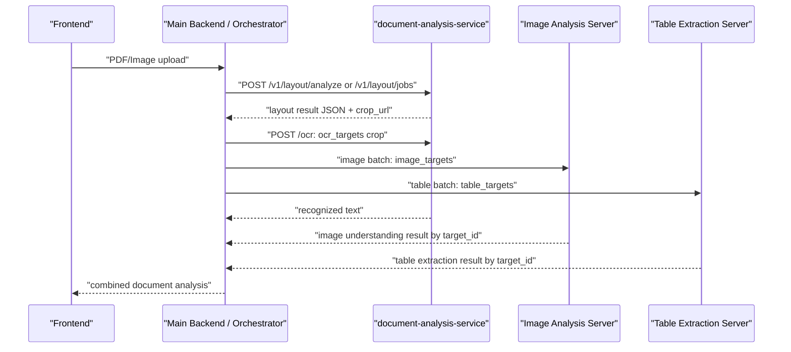

# Integration Flow

이 문서는 프론트/백엔드 프로젝트가 `document-analysis-service`를 호출하고, 결과를 OCR/이미지 분석/표 추출 흐름에 연결하는 실제 데이터 흐름을 정의합니다.
현재 Callog 통합에서는 layout-parser와 OCR을 같은 FastAPI 서버에서 제공하므로 백엔드는 분석 서버 하나만 바라보면 됩니다.

## 전체 흐름



권장 구조는 프론트가 직접 분석 서버까지 호출하지 않는 방식입니다. 프론트는 파일 업로드만 하고, 백엔드가 layout 결과를 받아 같은 분석 서버의 `/ocr` endpoint로 OCR crop을 전달합니다.

## 네트워크 전제

`crop_url`은 백엔드가 직접 접근할 수 있어야 합니다. 다른 컴퓨터에서 붙는다면 `docker-compose.yml`의 `PUBLIC_BASE_URL`을 `localhost`가 아니라 분석 서버 PC의 IP로 바꿉니다.

예:

```yaml
PUBLIC_BASE_URL: http://192.168.0.25:8001
```

잘못된 예:

```yaml
PUBLIC_BASE_URL: http://localhost:8001
```

위 설정은 analysis service 내부나 같은 PC의 브라우저에서는 되지만, 다른 컴퓨터의 백엔드에서는 `localhost`가 자기 자신을 의미하므로 crop 이미지를 가져올 수 없습니다.

## 업로드 API

동기 호출:

```http
POST /v1/layout/analyze
Content-Type: multipart/form-data
```

Form fields:

```text
document_id: 업무 시스템의 문서 ID
file: PDF 또는 이미지 파일
```

PowerShell:

```powershell
curl.exe -X POST "http://ANALYSIS_SERVER:8001/v1/layout/analyze" `
  -F "document_id=doc-20260514-001" `
  -F "file=@C:\path\to\document.pdf"
```

비동기 호출:

```http
POST /v1/layout/jobs
Content-Type: multipart/form-data
```

Form fields:

```text
document_id: 업무 시스템의 문서 ID
file: PDF 또는 이미지 파일
callback_url: 완료 후 layout service가 호출할 백엔드 URL
```

비동기 방식은 큰 PDF에 권장합니다. `callback_url`을 쓰면 layout service가 완료 결과 전체를 백엔드로 POST합니다.

## Layout 결과에서 사용할 값

최상위 응답:

```text
job_id              layout service 작업 ID
document_id         요청에서 넘긴 문서 ID
pages               페이지 정보와 debug/audit block
ocr_targets         분석 서버 `/ocr`로 보낼 대상
image_targets       이미지 분석 서버로 보낼 대상
table_targets       표 추출 서버로 보낼 대상
layout_result_url   compact layout JSON URL
```

실제 downstream 전송에는 `blocks`를 쓰지 않습니다. `blocks`는 감사/debug 후보까지 들어 있으므로 중복이 많습니다.

## OCR endpoint로 보낼 값

`ocr_targets`는 페이지당 1개가 기본입니다.

전송 단위:

```text
ocr_targets[].target_id
ocr_targets[].page
ocr_targets[].crop_url
ocr_targets[].metadata.ocr_input_size
ocr_targets[].metadata.ocr_input_scale
ocr_targets[].metadata.canvas_size
ocr_targets[].metadata.original_page_size
ocr_targets[].metadata.canvas_region_map
```

현재 백엔드는 `ocr_targets[].crop_url`을 다운로드한 뒤 같은 분석 서버의 `/ocr` endpoint에 multipart 파일로 전달합니다.
OCR endpoint는 기존 standalone OCR 서버와 같은 응답 형식을 유지합니다.

단일 crop OCR 요청 예:

```bash
curl -X POST http://ANALYSIS_SERVER:8001/ocr \
  -F "file=@crop.png"
```

기존 batch payload를 사용하는 별도 downstream 서버를 둘 때의 예:

```json
{
  "document_id": "doc-20260514-001",
  "layout_job_id": "layout-job-id",
  "task_type": "ocr_batch",
  "targets": [
    {
      "target_id": "ocr-0001",
      "page": 1,
      "type": "PageTextCanvas",
      "input": {
        "kind": "page_text_canvas",
        "image_url": "http://ANALYSIS_SERVER:8001/assets/{job_id}/clean_crops/page-001/page-001-text-canvas.png",
        "image_size": [1233, 1600],
        "coordinate_space": "ocr_input_image",
        "scale_to_canvas": 0.801603,
        "canvas_size": [1538, 1996],
        "original_page_size": [1653, 2339]
      },
      "mapping": {
        "canvas_region_map": []
      }
    }
  ]
}
```

별도 OCR 서버를 둔다면 해당 서버는 `input.image_url`을 다운로드해서 OCR을 수행합니다. OCR 결과에는 반드시 `target_id`, `page`를 그대로 포함해야 합니다.

권장 OCR 응답:

```json
{
  "document_id": "doc-20260514-001",
  "layout_job_id": "layout-job-id",
  "target_id": "ocr-0001",
  "page": 1,
  "text": "OCR로 추출된 전체 텍스트",
  "words": [
    {
      "text": "단어",
      "bbox": [10, 20, 80, 44],
      "coordinate_space": "ocr_input_image",
      "confidence": 0.98
    }
  ]
}
```

좌표 복원 규칙:

1. OCR word bbox가 `ocr_input_image` 기준이면 `ocr_input_scale`로 나눠서 canonical canvas 좌표로 변환합니다.
2. 변환된 bbox 중심점이 들어가는 `canvas_region_map[].canvas_bbox`를 찾습니다.
3. 원본 페이지 좌표는 다음 식으로 계산합니다.

```text
original_x = original_bbox.x1 + (canvas_x - canvas_bbox.x1)
original_y = original_bbox.y1 + (canvas_y - canvas_bbox.y1)
```

별도 OCR 서버가 좌표를 안 쓰고 텍스트만 반환한다면 `target_id`, `page`, `text`만 반환해도 됩니다.

## 이미지 분석 서버로 보낼 값

`image_targets`는 figure/image crop입니다.

전송 단위:

```text
image_targets[].target_id
image_targets[].page
image_targets[].crop_url
image_targets[].bbox
image_targets[].bbox_normalized
image_targets[].page_image_url
```

이미지 분석 서버 batch 요청 예:

```json
{
  "document_id": "doc-20260514-001",
  "layout_job_id": "layout-job-id",
  "task_type": "image_analysis_batch",
  "targets": [
    {
      "target_id": "image-0001",
      "page": 3,
      "type": "Figure",
      "input": {
        "kind": "figure_crop",
        "image_url": "http://ANALYSIS_SERVER:8001/assets/{job_id}/clean_crops/page-003/region-005-image_region-image_analysis_server.png",
        "coordinate_space": "original_page_image"
      }
    }
  ]
}
```

권장 이미지 분석 응답:

```json
{
  "document_id": "doc-20260514-001",
  "layout_job_id": "layout-job-id",
  "target_id": "image-0001",
  "page": 3,
  "summary": "이미지 설명",
  "labels": ["chart", "screenshot"],
  "risk_flags": []
}
```

## 표 추출 서버로 보낼 값

`table_targets`는 표 crop입니다.

전송 단위:

```text
table_targets[].target_id
table_targets[].page
table_targets[].crop_url
table_targets[].bbox
table_targets[].bbox_normalized
```

권장 표 추출 응답:

```json
{
  "document_id": "doc-20260514-001",
  "layout_job_id": "layout-job-id",
  "target_id": "table-0001",
  "page": 1,
  "markdown": "| A | B |\\n|---|---|\\n| 1 | 2 |",
  "cells": []
}
```

## 바로 쓰는 통합 클라이언트

이 프로젝트에는 layout 분석 결과를 downstream batch payload로 변환하는 스크립트가 포함되어 있습니다.

분석만 하고 payload 파일 생성:

```powershell
python tools\layout_flow_client.py `
  --layout-url http://ANALYSIS_SERVER:8001 `
  --file C:\path\to\document.pdf `
  --document-id doc-20260514-001 `
  --dry-run `
  --output storage\last_dispatch_payloads.json
```

이미 받은 layout result JSON으로 payload 생성:

```powershell
python tools\layout_flow_client.py `
  --result-json storage\results\{job_id}\result.json `
  --dry-run `
  --output storage\last_dispatch_payloads.json
```

별도 OCR/이미지/표 서버까지 전송:

```powershell
python tools\layout_flow_client.py `
  --layout-url http://ANALYSIS_SERVER:8001 `
  --file C:\path\to\document.pdf `
  --document-id doc-20260514-001 `
  --ocr-url http://OCR_SERVER:9000/v1/ocr/batch `
  --image-url http://IMAGE_SERVER:9100/v1/image-analysis/batch `
  --table-url http://TABLE_SERVER:9200/v1/table/batch `
  --output storage\last_dispatch_payloads.json
```

서버 URL을 생략하면 해당 서버로는 전송하지 않습니다.

## 프론트 예시

정적 예시 파일:

```text
examples/frontend-upload.html
```

브라우저에서 열고 layout service URL, document_id, 파일을 넣으면 `/v1/layout/analyze`를 호출합니다.

운영 프론트에서는 응답 전체를 화면에 들고 있지 말고, 백엔드가 `job_id`, `document_id`, target count, 진행 상태만 관리하는 것이 좋습니다.

## 결합 기준

최종 분석 결과를 합칠 때 기준 키는 다음입니다.

```text
document_id
layout_job_id
target_id
page
reading_order
```

페이지 내 순서는 `reading_order`를 사용합니다. OCR 결과, 이미지 분석 결과, 표 추출 결과는 모두 `target_id`로 원래 layout target에 연결합니다.

## 운영 체크리스트

- `PUBLIC_BASE_URL`이 백엔드에서 접근 가능한 주소인지 확인
- 백엔드에서 `ocr_targets[].crop_url` 다운로드 가능한지 확인
- 백엔드의 `OCR_SERVICE_URL`이 같은 분석 서버의 `/ocr`를 바라보는지 확인
- 이미지 서버에서 `image_targets[].crop_url` 다운로드 가능한지 확인
- 표 서버에서 `table_targets[].crop_url` 다운로드 가능한지 확인
- 각 downstream 응답에 `target_id`가 그대로 돌아오는지 확인
- frontend는 파일 업로드, backend는 orchestration 담당
