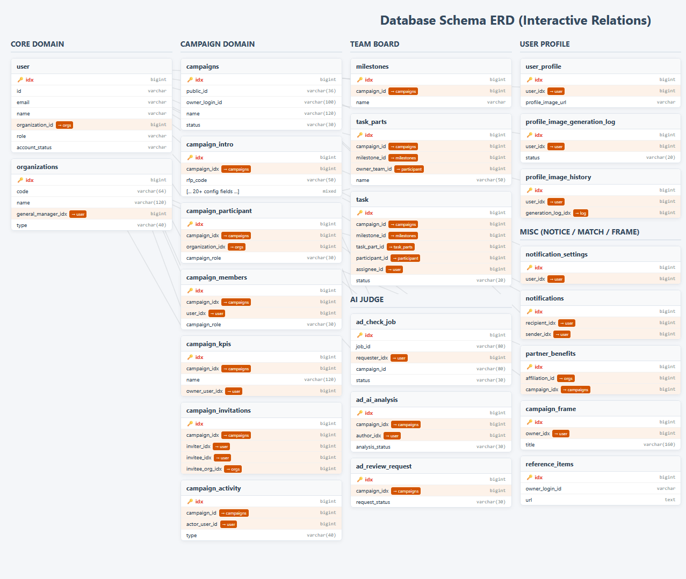

<div align="center">
  
</div>

---

## 👥 팀원

<div align="center">

| **이성재** | **최재원** | **김미정** | **범윤준** | **김주형** |
| :---: | :---: | :---: | :---: | :---: |
|  |  |  |  |  |
| [@Tahcy-99](https://github.com/Tahcy-99) | [@Lumisia](https://github.com/Lumisia) | [@mihub02](https://github.com/mihub02) | [@Yoonjoon13](https://github.com/Yoonjoon13) | [@Joohyeng](https://github.com/Joohyeng) |

</div>

---

## 목차

1. [프로젝트 소개](#프로젝트-소개)
2. [서비스 구조](#서비스-구조)
3. [기술 스택](#기술-스택)
4. [레포지토리 구조](#레포지토리-구조)
5. [요구사항 정의서](#요구사항-정의서)
6. [시스템 아키텍처](#시스템-아키텍처)
7. [DB 설계](#db-설계)
8. [기능 테스트 및 시연](#기능-테스트-및-시연)
9. [무중단 배포 테스트](#무중단-배포-테스트)

---

## 프로젝트 소개

Callog는 캠페인 기획부터 실행, 성과 관리, 콘텐츠 제작, 파트너 협업까지 하나의 흐름으로 관리할 수 있는 서비스입니다.

사용자는 캠페인별 목표와 KPI를 설정하고, 일정과 업무를 관리하며, 콘텐츠 작성 및 파트너 제안 검토를 진행할 수 있습니다.

프론트엔드와 백엔드의 자세한 실행 방법, 기술 스택, 기능 테스트, 배포 방식은 각 README에서 확인할 수 있습니다.

---

## 서비스 구조

```text
Client
  |
  |-- Frontend: Vue 3 + Vite
  |
Gateway
  |
  |-- Spring Gateway
  |-- Eureka
  |
Backend Services
  |
  |-- App Service
  |-- Matching Evaluation Service
  |-- AI Judge Service
```

---

## 기술 스택

| 영역 | 기술                                                  |
| --- |-----------------------------------------------------|
| Frontend | Vue 3, Vite, Pinia, Vue Router, Tailwind CSS, Axios |
| Backend | Java 17, Spring Boot, Spring Cloud, Gradle          |
| Service Discovery | Eureka                                              |
| Gateway | Spring Cloud Gateway                                |
| Deployment | Docker, Nginx                                       |
| CI/CD | Jenkins, K8s                                        |

---

## 레포지토리 구조

```text
.
├── frontend/              # 프론트엔드 Vue 애플리케이션
├── backend/               # 백엔드 멀티 모듈 Spring 프로젝트
│   ├── app/
│   ├── spring-gw/
│   ├── eureka/
│   ├── matching-evaluation/
│   └── aijudge/
├── docs/                  # 프로젝트 문서
├── cicd/                  # CI/CD 관련 파일
└── README.md              # 전체 프로젝트 안내 문서
```

---

## 요구사항 정의서

| 문서 | 설명 |
| --- | --- |
| [요구사항 정의서 보기](https://raw.githack.com/beyond-sw-camp/be24-fin-magamFairy-callog/main/docs/PRD.html) | 서비스 요구사항, 주요 기능, 사용자 흐름, 기능별 우선순위를 정리한 요구사항 정의서 |

---

## 시스템 아키텍처


- **테스트 빌드:** sub 브랜치에 Push할 경우, Main과 동일하게 조성된 서버환경에 사전 배포, 각종 테스트를 거친 후 Main 브랜치 Push
- **CI/CD 흐름:** 코드 Push → Jenkins 웹훅 감지 → 빌드 및 Docker 이미지 패키징 → Kubernetes 클러스터 배포
- **무중단 배포 전략:** Blue Green 전환방식, 안정성 확보를 위해 Jenkins에서 자동으로 전환하지 않고 수동으로 전환.
- **MSA 적용:** Database Per Service, Circuit Breaker, Event Sourcing, API-Gateway 패턴 적용

---

## DB 설계



### 데이터 저장 구조

| 구분 | 저장소 | 주요 데이터 |
| --- | --- | --- |
| 핵심 서비스 데이터 | MariaDB | 사용자, 조직, 캠페인, 참여자, 업무, 마일스톤, KPI, 알림, 레퍼런스 |
| AI 검수 결과 | MongoDB | AI 검수 job 결과, 분석 상세, 원본 응답 데이터 |
| 매칭 평가 결과 | MongoDB | 파트너 혜택 평가 결과, 평가 점수, 개선 방향 |

### 상세 문서

| 문서 | 설명 |
| --- | --- |
| [mongodb_aijudge.html](./docs/mongodb_aijudge.html) | AI 검수 결과 저장 구조 |
| [mongodb_evaluation.html](./docs/mongodb_evaluation.html) | 매칭 평가 결과 저장 구조 |

---

## 기능 테스트 및 시연

기능 테스트 영상과 시연 자료는 프론트엔드/백엔드 README에서 기능별로 확인할 수 있습니다.

- 프론트 기능 테스트 영상: [frontend/README.md](./frontend/README.md)
- 백엔드 API 테스트 및 시나리오: [backend/README.md](./backend/README.md)
- 전체 기능 테스트 가이드: [docs/callog-feature-test-guide.md](./docs/callog-feature-test-guide.md)

---

## 무중단 배포 테스트

### Frontend Canary

프론트엔드는 Canary 배포 방식을 적용하여 신규 버전을 일부 트래픽에 먼저 배포하고, 정상 동작 확인 후 전체 트래픽으로 점진 확대하는 방식으로 테스트했습니다.


### Backend Blue/Green

백엔드는 Blue/Green 배포 방식을 적용하여 기존 버전과 신규 버전을 분리해 운영하고, 검증 완료 후 트래픽을 전환하는 방식으로 테스트했습니다.


